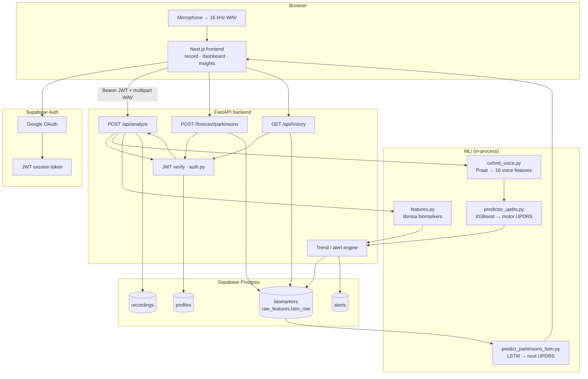
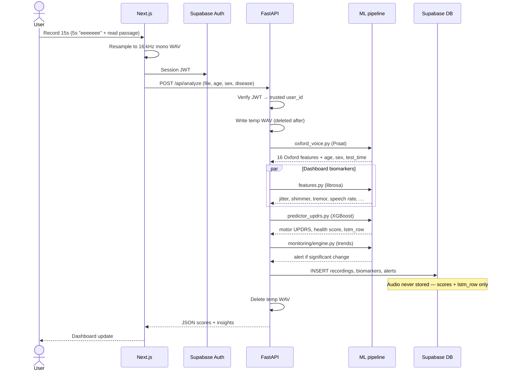
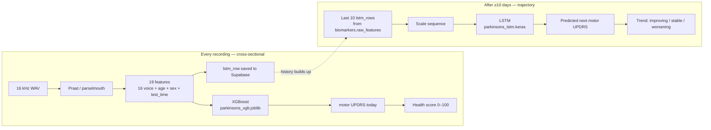

# Vocalis

**Vocalis** is a voice diary for **Parkinson's disease monitoring**. Patients record a short guided voice sample each day; the system extracts clinical acoustic biomarkers, estimates **motor UPDRS** from speech, tracks trends over time, and forecasts progression using an LSTM when enough history exists.

> **Not a medical device.** Portfolio / research demo for voice-based symptom tracking between clinic visits. Audio is analyzed in memory and **never stored** — only numeric scores go to the database.

---

## Why voice for Parkinson's?

Parkinson's affects motor control of speech: voice becomes less steady (higher **jitter** and **shimmer**), breathier (lower **HNR**), and harder to sustain. Clinical studies use these measures from sustained vowels and read speech. Vocalis turns a 15-second daily recording into structured scores aligned with the **Oxford Parkinson's Telemonitoring** dataset and **motor UPDRS** scale.

---

## User journey (Parkinson's flow)

```
Sign in (Google) → Onboarding (age, sex, Parkinson's) → Daily record → Dashboard → Insights → Forecast
```

| Step | What happens |
|------|----------------|
| **1. Onboarding** | User signs in with Google, enters name, **age**, **sex**, and selects **Parkinson's**. Profile syncs to Supabase. |
| **2. Record** (`/record`) | 15-second guided task: sustain **"eeeeeee"** for 5s, then read a fixed sentence. Browser captures 16 kHz mono WAV. |
| **3. Analyze** | WAV is sent to `POST /api/analyze`. Backend runs ML, saves scores, deletes the audio file. |
| **4. Dashboard** (`/`) | Health score (0–100), motor UPDRS, tremor/jitter/shimmer cards, assessment history, optional forecast widget. |
| **5. Insights** (`/insights`) | Charts of biomarker trends over days (aggregated from Supabase history). |
| **6. Forecast** | After **≥10 days** of complete history, LSTM predicts **next motor UPDRS** and shows improving / stable / worsening trend. |

Optional: **import medical CSV/PDF** to seed historical rows for demo or faster LSTM unlock.

---

## System architecture

### High-level components



| Layer | Role |
|-------|------|
| **Frontend** | Recording UI, Google auth, charts, dashboard |
| **Backend** | JWT verification, temp file handling, Supabase writes, trend alerts |
| **ML** | Feature extraction + XGBoost (today's score) + LSTM (forecast) |
| **Supabase** | Users, profiles, session scores, alerts |

### Analyze request flow (`POST /api/analyze`)



### Dual-model ML pipeline (Parkinson's)



**Audio path:** WAV exists only on disk for the duration of analysis (~seconds), then is removed. **Persistence path:** numeric scores and `lstm_row` JSON only.

---

## What happens when you press Record (logic)

### 1. Capture (browser)

- `MediaRecorder` records microphone audio.
- Audio is resampled to **16 kHz mono WAV** in the browser.
- Form sent to API: `file`, `disease=Parkinson's`, `age`, `sex`, `onboarded_at`, plus `Authorization: Bearer <token>`.

### 2. Auth (backend)

- FastAPI verifies the Supabase JWT (`backend/auth.py`).
- Trusted `user_id` comes from the token — not from the client alone.

### 3. Feature extraction (Praat / parselmouth)

Audio is written to a **temporary file**, then [`ML/preprocessing/oxford_voice.py`](ML/preprocessing/oxford_voice.py) runs **Praat** algorithms via `praat-parselmouth` to compute **16 Oxford voice measures**:

| Category | Examples |
|----------|----------|
| Pitch instability | Jitter(%), Jitter:RAP, Jitter:PPQ5, … |
| Amplitude instability | Shimmer, Shimmer(dB), Shimmer:APQ3, … |
| Voice quality | HNR, NHR |
| Complexity | RPDE, DFA, PPE |

Combined with **age**, **sex**, and **test_time** (days since onboarding) → **19 inputs** for the UPDRS model.

Librosa is also used in parallel to produce **dashboard biomarkers** (tremor, speech rate, pause patterns) for charts — separate from the Oxford model inputs.

### 4. Session score — XGBoost → motor UPDRS

[`ML/inference/predictor_updrs.py`](ML/inference/predictor_updrs.py):

1. Load `parkinsons_xgb.joblib` (trained on Oxford telemonitoring data).
2. Predict **`motor_UPDRS`** (clinical motor severity scale, typically ~8–40 in training range).
3. Map UPDRS to a **0–100 health score** using `parkinsons_updrs_scale.json`.
4. Derive sub-scores: tremor, breathlessness, speech steadiness.
5. Build an **`lstm_row`** — the 19-feature vector + motor UPDRS — stored for future forecasting.

### 5. Persist (Supabase)

[`backend/routers/analysis.py`](backend/routers/analysis.py) writes:

- **`recordings`** — session metadata (timestamp, no audio).
- **`biomarkers`** — health score, UPDRS, jitter, shimmer, etc. + `raw_features` JSONB (`lstm_row`, clinical insights, prediction).
- **`alerts`** — if trend engine detects significant change vs prior sessions.

Temp WAV is **deleted** in a `finally` block.

### 6. Response → UI

Dashboard shows motor UPDRS, health score, risk label (NORMAL / MODERATE / HIGH), and metric cards.

---

## Progression forecast — LSTM (second model)

**Question XGBoost answers:** *How severe is today's voice sample?*  
**Question LSTM answers:** *Given the last 10 days, where is motor UPDRS heading?*

| Stage | Logic |
|-------|--------|
| **History build-up** | Each analysis stores a complete `lstm_row` in Supabase. One row per day (aggregated if multiple recordings). |
| **Gate** | `POST /forecast/parkinsons` requires **≥10** complete rows (`ML/inference/predict_parkinsons_lstm.py`). |
| **Model** | TensorFlow LSTM (`parkinsons_lstm.keras`) on scaled sequences of 19 features per day. |
| **Output** | Predicted next `motor_UPDRS`, delta vs today, trend label (improving / stable / worsening). |

XGBoost = **cross-sectional** (one recording). LSTM = **longitudinal** (trajectory across days).

---

## Database schema (scores only)

Run [`supabase_schema.sql`](supabase_schema.sql) and [`supabase_migrate_profiles.sql`](supabase_migrate_profiles.sql).

| Table | Stores |
|-------|--------|
| `profiles` | Name, age, sex, condition |
| `recordings` | Session time, duration — **no audio** |
| `biomarkers` | Scores + `raw_features` (includes `lstm_row`) |
| `alerts` | Trend / anomaly events |

---

## Project structure

```
Vocalis/
├── frontend/              Next.js UI (record, dashboard, insights)
├── backend/               FastAPI API + Supabase integration
├── ML/
│   ├── preprocessing/     oxford_voice.py (Praat), features.py (librosa)
│   ├── inference/         predictor_updrs.py, predict_parkinsons_lstm.py
│   ├── models/            Pre-trained weights (included — clone and run)
│   └── TRAINING.md          Retrain models from notebooks
├── supabase_schema.sql
└── supabase_migrate_profiles.sql
```

---

## Run locally

**Prerequisites:** Node 18+, Python 3.11, Supabase project with Google OAuth.

```powershell
git clone https://github.com/tanishR28/Vocalis.git
cd Vocalis
python -m venv .venv
.venv\Scripts\activate
pip install -r backend/requirements.txt
```

**Supabase:** Run both SQL files in the SQL Editor → enable Google → add redirect `http://localhost:3000/auth/callback`.

**Backend** — copy `backend/.env.example` → `backend/.env`, fill Supabase keys:

```powershell
cd backend
uvicorn main:app --reload --port 8000
```

**Frontend** — copy `frontend/.env.example` → `frontend/.env.local`:

```powershell
cd frontend
npm install
npm run dev
```

Open http://localhost:3000 · API docs http://localhost:8000/docs

---

## Key API routes

| Route | Purpose |
|-------|---------|
| `POST /api/analyze` | Upload WAV → UPDRS + biomarkers → Supabase |
| `GET /api/history` | Past assessments for charts |
| `POST /forecast/parkinsons` | LSTM progression forecast |
| `GET /docs` | Swagger UI |

---

## Tech stack

Next.js · FastAPI · Supabase (PostgreSQL + Google Auth) · Praat/parselmouth · Librosa · XGBoost · TensorFlow LSTM

---

## License

MIT — demonstration and portfolio use only.
